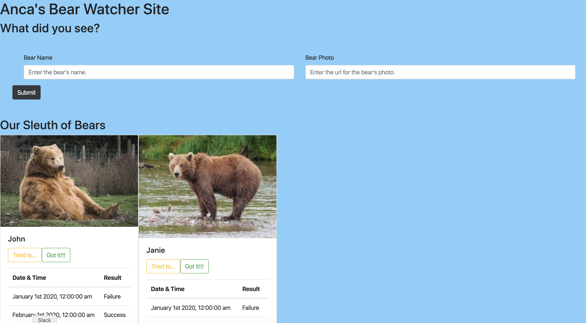

# Bear-Watcher Site

## Description
This site is an exploration into using ES6 modules. It is a site that scientists and park rangers can use to track brown bear feeding behavior, with their failures and successes, during salmon season in July and August. 

## Screenshot

## How to Run
1. Clone down this repo.
1. Make sure you have http-server installed via npm. If not, get it [here](https://www.npmjs.com/package/http-server).
1. On your command line, run `hs -p 9999`.
1. In your browser, navigate to `http://localhost:9999`.
