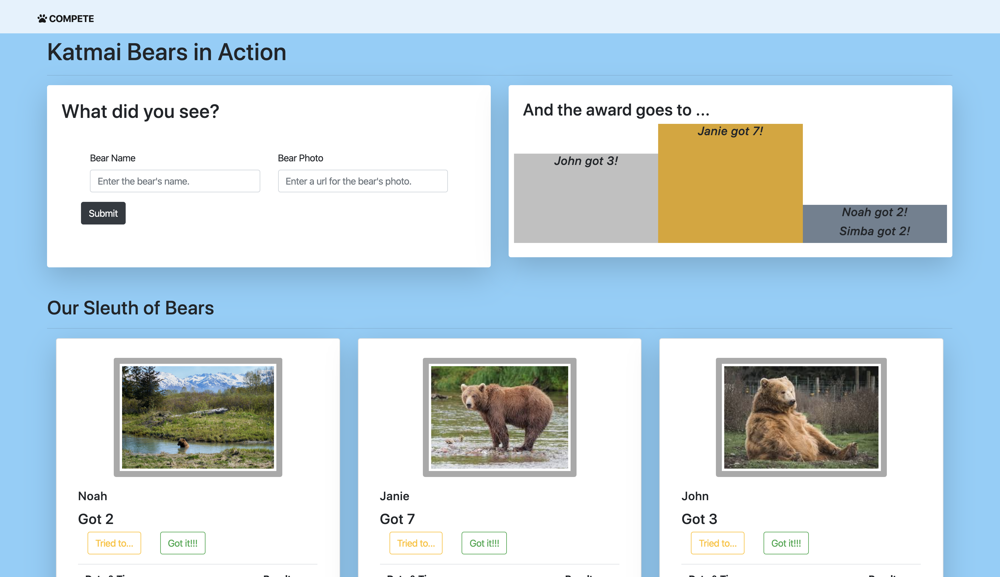

# Compete

## Description
This project is an exploration into using ES6 modules. It allows the park rangers in Alaska's Katmai National Park to track brown bear feeding behavior during salmon season in July and August, keep a record of the bears' attempts and successes catching fish, and quickly identify the winners.

## Background
* This project was a culmination of what we learned during the second milestone (Patterns & Tools) in our front-end bootcamp program. It allowed us to practice our most recently acquired skills of organizing our project files based on their purpose - whether they manipulate data or control the display on a page or include code to run utilities and then import that content accordingly only when necessary. Most of the projects we had worked on up to this point were fairly small. However, as we were learning about this new structure and I was thinking back to the Patient Tracker project, for example, which was my largest one at that point in time, I certainly could see the immense benefit of separating content so you can both control scope and context as well as easily find and fix issues. 
* In addition, I explored some new Javascript methods, such as .reduce() and Object.values() methods , in order to group bear objects by key value to identify those with the highest fish count and dynamically update the awards list on the site. 
* I also started writing getter and setter methods for retrieving and updating data in the data file. 
* Some of my hikes along the years have allowed me glimpses of these massive and gorgeous carnivores. No, I will not get out of my car and take a picture even at some distance in front of a black bear at Cades Cove in the Smokies, and, yes, I will sing at the top of my lungs and put bells on my backpack as I hike through Glacier National Park. Like with all wildlife, I love enjoying bears from a distance. And that's why I also particularly enjoyed working on this assignment and staring at these pictures for hours as I was figuring out various nuances of the site. I mean - wouldn't you want to be out there? Me, too. Just ... on the opposite side of the mountain, checking them out through binoculars!

## Feature List
1. Users can track a new bear by quickly adding a name and photo. The name is required, and a user's entry is validated accordingly.
1. Users can record if a bear on the list has attempted to catch a fish (and failed) or if he/she actually succeeded. 
1. Users can see the details of each bear's activity, including a tally of their total catches and a list of attempts and succeses with timestamps. 
1. The site instantly calculates the top 3 winners and displays their names and photos for the user's review. If multiple bears have caught the same number of fish and their score falls in the top 3, then the podium displays all the bears with that score. 

## Screenshots
##### Home Page

##### Bear Name Validation

##### Individual Bear Activity

## Technologies & Tools
Bootstrap, CSS, ES6 Modules (for organizing  files based on purpose and content), Github (for version control), HTML, JavaScript, JQuery

## How to Run
1. Clone down this repo.
1. Make sure you have http-server installed via npm. If not, get it [here](https://www.npmjs.com/package/http-server).
1. On your command line, run `hs -p 9999`.
1. In your browser, navigate to `http://localhost:9999`.

## Firebase Deployment
This project has been deployed with Firebase. 
You can access it [here](https://pinterest-4b62d.web.app/). 
